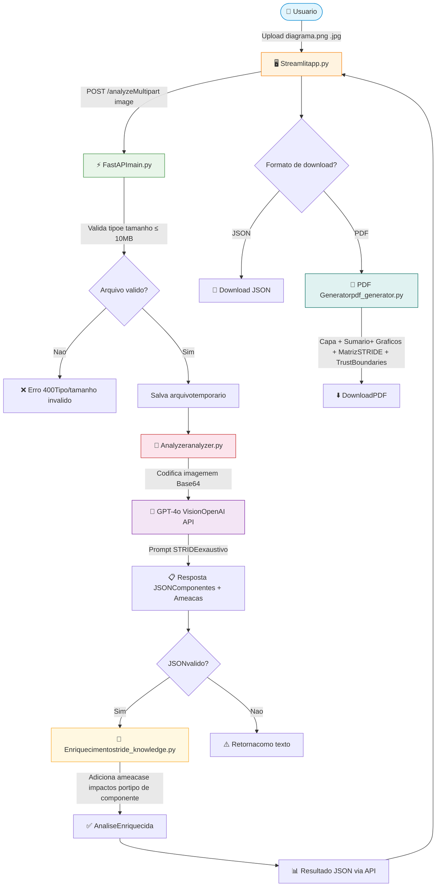

# 🔒 Analisador de Ameaças STRIDE com IA

Sistema de análise automática de diagramas de arquitetura de software usando a metodologia STRIDE (Spoofing, Tampering, Repudiation, Information Disclosure, Denial of Service, Elevation of Privilege) com GPT-4 Vision.

> **🎯 TL;DR**: Upload de um diagrama de arquitetura → IA analisa com metodologia STRIDE → Relatório PDF com ameaças e contramedidas

**Status**: ✅ MVP Completo e Funcional | **Fase**: 6/7 | **Stack**: Python + FastAPI + Streamlit + GPT-4 Vision

## 📋 Índice

- [Projeto](#-projeto)
- [Funcionalidades](#-funcionalidades)
- [Fluxo da Solução](#-fluxo-da-solução)
- [Requisitos do Sistema](#-requisitos-do-sistema)
- [Instalação](#-instalação)
- [Uso](#-uso)
  - [Interface Web](#opção-1-interface-web-recomendado-)
  - [API REST](#opção-2-api-rest-)
  - [Script Python](#opção-3-script-python-direto-)
- [Metodologia STRIDE](#-o-que-é-stride)
- [Formato da Análise](#-formato-da-análise)
- [Documentação](#-documentação)
- [Dependências](#-dependências-principais)
- [Próximos Passos](#-próximos-passos)
- [Guia para Assistentes de IA](#-guia-para-assistentes-de-ia) ⭐
- [Troubleshooting](#-troubleshooting)
- [Autor](#-autor)
- [Licença](#-licença)

## 📋 Projeto

Este projeto foi desenvolvido para o **Hackathon FIAP Fase 5** e utiliza Inteligência Artificial para identificar ameaças de segurança em arquiteturas de software.

## 🎯 Funcionalidades

- ✅ **FASE 1**: Setup do projeto e configuração de ambiente
- ✅ **FASE 2**: Base de conhecimento STRIDE implementada
- ✅ **FASE 3**: Análise de arquitetura com GPT-4 Vision
- ✅ **FASE 4**: API REST com FastAPI
- ✅ **FASE 5**: Interface Web com Streamlit
- ✅ **FASE 6**: Geração de Relatórios PDF
- 🔄 **FASE 7**: Testes e documentação completa

## 🔄 Fluxo da Solução



### Etapas do Pipeline

1. **Upload** (`app.py`): Usuário faz upload de um diagrama de arquitetura via interface Streamlit
2. **Validação** (`main.py`): API FastAPI valida tipo (PNG/JPG/JPEG) e tamanho (máx 10MB) do arquivo
3. **Análise com IA** (`analyzer.py`): Imagem é codificada em base64 e enviada para GPT-4o Vision com prompt STRIDE exaustivo que solicita identificação de todos os componentes, ameaças, trust boundaries e fluxos de dados
4. **Enriquecimento** (`stride_knowledge.py`): A análise do LLM é complementada com uma base de conhecimento local que adiciona categorias STRIDE faltantes, descrições detalhadas e impactos contextualizados para cada tipo de componente
5. **Geração de Relatório** (`pdf_generator.py`): Relatório PDF profissional com capa, sumário executivo, gráfico de severidade, análise detalhada por componente, fluxos de dados, matriz STRIDE panorâmica e trust boundaries
6. **Download**: Usuário baixa relatório em JSON (dados estruturados) ou PDF (relatório formatado)

## 📋 Requisitos do Sistema

### Software Necessário

- **Python**: 3.8 ou superior
- **pip**: Gerenciador de pacotes Python
- **Conta OpenAI**: Com acesso a GPT-4 Vision
- **Sistema Operacional**: macOS, Linux ou Windows

### Dependências Python

Todas as dependências estão listadas em `requirements.txt`:
- openai (>=1.0.0)
- fastapi (>=0.100.0)
- uvicorn (>=0.23.0)
- streamlit (>=1.28.0)
- pillow (>=10.0.0)
- reportlab (>=4.0.0)
- python-dotenv (>=1.0.0)
- requests (>=2.31.0)

### Recursos Estimados

- **Espaço em disco**: ~500 MB (com dependências)
- **RAM**: Mínimo 2 GB, recomendado 4 GB
- **Internet**: Necessária para API OpenAI
- **Custo estimado**: ~$0.02-0.05 por análise (GPT-4 Vision)

## 🚀 Instalação

### 1. Clone o repositório

```bash
git clone https://github.com/seu-usuario/Hackathon_fase5.git
cd Hackathon_fase5
```

### 2. Crie e ative o ambiente virtual

```bash
python -m venv venv
source venv/bin/activate  # No macOS/Linux
# ou
venv\Scripts\activate  # No Windows
```

### 3. Instale as dependências

```bash
pip install -r requirements.txt
```

### 4. Configure a chave da API OpenAI

Copie o arquivo de exemplo e configure sua chave:

```bash
cp .env.example .env
```

Edite o arquivo `.env` e adicione sua chave da API OpenAI:

```
OPENAI_API_KEY=sk-sua-chave-aqui
```

> 🔑 Obtenha sua chave em: https://platform.openai.com/api-keys

## 💻 Uso

### Opção 1: Interface Web (Recomendado) 🌐

A maneira mais fácil de usar o sistema é através da interface web com Streamlit:

#### 1. Inicie a API (Terminal 1)

```bash
uvicorn main:app --reload
```

A API estará disponível em: http://localhost:8000
- Documentação interativa: http://localhost:8000/docs
- Health check: http://localhost:8000/health

#### 2. Inicie a Interface Web (Terminal 2)

```bash
streamlit run app.py
```

A interface estará disponível em: http://localhost:8501

#### 3. Use a Interface

1. Faça upload de um diagrama de arquitetura (PNG, JPG ou JPEG)
2. Clique em "🚀 Analisar Ameaças"
3. Aguarde a análise da IA (10-20 segundos)
4. Revise as ameaças identificadas por componente
5. **Opções de download:**
   - Clique em "💾 Baixar Relatório (JSON)" para dados estruturados
   - Clique em "📄 Gerar Relatório PDF" para relatório profissional
   - Após gerar, clique em "⬇️ Baixar PDF Gerado"
6. Use "🔄 Nova Análise" para analisar outro diagrama

### Opção 2: API REST 🚀

Para integrar com outros sistemas, use a API REST:

#### Verificar saúde da API

```bash
curl http://localhost:8000/health
```

#### Analisar uma imagem (retorna JSON)

```bash
curl -X POST "http://localhost:8000/analyze" \
  -H "Content-Type: multipart/form-data" \
  -F "image=@examples/arquitetura.png"
```

#### Analisar e gerar PDF diretamente

```bash
curl -X POST "http://localhost:8000/analyze-pdf" \
  -H "accept: application/pdf" \
  -F "image=@examples/arquitetura.png" \
  -o "relatorio_stride.pdf"
```

#### Obter informações sobre STRIDE

```bash
curl http://localhost:8000/stride-info
```

### Opção 3: Script Python Direto 🐍

Para analisar uma imagem de arquitetura diretamente:

```bash
python analyzer.py caminho/para/imagem.png
```

Exemplo:

```bash
python analyzer.py examples/arquitetura_exemplo.png
```

### Análise Programática

```python
from analyzer import analyze_architecture

# Analisar arquitetura
result = analyze_architecture("examples/arquitetura.png")

if result["success"]:
    print("Análise concluída!")
    print(result["analysis"])
else:
    print(f"Erro: {result['error']}")
```

## 📁 Estrutura do Projeto

```
Hackathon_fase5/
├── main.py                 # API REST FastAPI
├── app.py                  # Interface Web Streamlit
├── analyzer.py             # Análise com GPT-4 Vision
├── stride_knowledge.py     # Base de conhecimento STRIDE
├── pdf_generator.py        # Gerador de relatórios PDF
├── test_analyzer.py        # Testes do analisador
├── requirements.txt        # Dependências Python
├── .env.example            # Exemplo de configuração
├── .gitignore              # Arquivos ignorados pelo git
├── README.md               # Esta documentação
├── docs/                   # Documentação
│   ├── QUICKSTART.md       # Guia rápido de início
│   ├── PLANO_IMPLEMENTACAO_SIMPLIFICADO.md  # Plano de implementação
│   ├── AVALIACAO_PROJETO.md # Testes e validações
│   └── IADT - Fase 5 - Hackaton.pdf
└── examples/               # Imagens de exemplo
    └── README.md           # Documentação dos exemplos
```

## 🛡️ Metodologia STRIDE

O sistema analisa diagramas de arquitetura aplicando as 6 categorias da metodologia STRIDE:

| Categoria | Descrição | Foco |
|-----------|-----------|------|
| **S**poofing | Falsificação de identidade | Autenticação |
| **T**ampering | Adulteração de dados | Integridade |
| **R**epudiation | Negação de ações realizadas | Não-repúdio |
| **I**nformation Disclosure | Vazamento de informações | Confidencialidade |
| **D**enial of Service | Negação de serviço | Disponibilidade |
| **E**levation of Privilege | Elevação de privilégios | Autorização |

## 🔍 O que o Sistema Faz

1. **Identifica Componentes**: Reconhece automaticamente componentes no diagrama (APIs, bancos de dados, usuários, servidores, etc)
2. **Aplica STRIDE**: Para cada componente, identifica ameaças nas 6 categorias
3. **Analisa Fluxos**: Identifica riscos nas comunicações entre componentes
4. **Sugere Contramedidas**: Propõe soluções práticas para cada ameaça
5. **Prioriza Riscos**: Classifica ameaças por criticidade (Alta, Média, Baixa)

## 📊 Resultados da Análise

O sistema gera um relatório completo contendo:

- **10+ componentes** identificados automaticamente no diagrama
- **40+ ameaças** classificadas por severidade (Alta/Média/Baixa)
- **Contramedidas** específicas para cada ameaça identificada
- **Matriz STRIDE** panorâmica mostrando cobertura por componente
- **Trust Boundaries** com análise de fronteiras de confiança
- **Fluxos de Dados** com protocolos, criptografia e autenticação
- **Risk Score** geral (0-10) com justificativa
- **Gráfico de severidade** com distribuição das ameaças

## 📊 Formato da Análise

A análise retorna um JSON estruturado com:

```json
{
  "componentes": [...],
  "fluxos_dados": [...],
  "resumo": {
    "total_componentes": 5,
    "total_ameacas": 15,
    "ameacas_alta": 3,
    "ameacas_media": 8,
    "ameacas_baixa": 4
  },
  "recomendacoes_gerais": [...]
}
```

## 📚 Documentação

Este projeto possui documentação completa organizada no diretório [`docs/`](docs/):

- **[Quick Start](docs/QUICKSTART.md)** - Guia rápido para começar a usar
- **[Plano de Implementação](docs/PLANO_IMPLEMENTACAO_SIMPLIFICADO.md)** - Arquitetura e implementação
- **[Avaliação do Projeto](docs/AVALIACAO_PROJETO.md)** - Testes e validações realizadas
- **[Documento do Hackathon](docs/IADT%20-%20Fase%205%20-%20Hackaton.pdf)** - Documento oficial FIAP
- **[Relatórios de Exemplo](docs/reports/)** - PDFs de exemplo gerados pelo sistema

📖 **Acesse o [índice completo de documentação](docs/README.md)**

## 🔧 Dependências Principais

- **OpenAI** (>=1.0.0): Para GPT-4 Vision
- **FastAPI** (>=0.100.0): Framework para API REST
- **Uvicorn** (>=0.23.0): Servidor ASGI para FastAPI
- **Streamlit** (>=1.28.0): Interface web interativa
- **Pillow** (>=10.0.0): Processamento de imagens
- **ReportLab** (>=4.0.0): Geração de relatórios PDF
- **python-dotenv** (>=1.0.0): Gerenciamento de variáveis de ambiente
- **requests** (>=2.31.0): Requisições HTTP

## 📝 Próximos Passos

- [x] Implementar API REST com FastAPI
- [x] Criar interface web com Streamlit
- [x] Gerar relatórios em PDF
- [ ] Adicionar testes automatizados completos
- [ ] Implementar cache de análises
- [ ] Adicionar suporte a múltiplos modelos de IA
- [ ] Deploy em produção (Docker/Cloud)

---

## 🤖 Guia para Assistentes de IA

> Esta seção foi criada para assistentes de IA entenderem rapidamente o projeto e poderem dar continuidade às implementações.

### 📊 Visão Geral do Sistema

Este é um **sistema de análise de ameaças de segurança** que utiliza **GPT-4 Vision** para identificar vulnerabilidades em diagramas de arquitetura de software, aplicando a **metodologia STRIDE** da Microsoft.

### 🏗️ Arquitetura do Projeto

#### Módulos Principais

| Arquivo | Responsabilidade | Tecnologia |
|---------|------------------|------------|
| `main.py` | API REST - endpoints de análise | FastAPI |
| `app.py` | Interface Web - UI do usuário | Streamlit |
| `analyzer.py` | Motor de análise - processamento IA | OpenAI GPT-4 Vision |
| `pdf_generator.py` | Geração de relatórios profissionais | ReportLab |
| `stride_knowledge.py` | Base de conhecimento - metodologia STRIDE | Python Dict/JSON |

#### Fluxo de Dados Detalhado

1. **Upload (app.py)**: Usuário faz upload via Streamlit
2. **Request (app.py → main.py)**: POST /analyze com imagem
3. **Validação (main.py)**: Valida tipo e tamanho do arquivo
4. **Análise (analyzer.py)**:
   - Codifica imagem em base64
   - Envia para GPT-4 Vision com prompt STRIDE
   - Parseia resposta JSON
5. **Resposta (main.py → app.py)**: Retorna análise estruturada
6. **Apresentação (app.py)**: Exibe resultados + opção de PDF
7. **PDF (pdf_generator.py)**: Gera relatório formatado

### 📁 Estrutura de Dados

#### Input: Imagem do Diagrama
```python
# Formatos aceitos: PNG, JPG, JPEG
# Tamanho máximo: 10MB
# Resolução recomendada: >= 800x600px
```

#### Output: Análise STRIDE
```json
{
  "success": true,
  "analysis": {
    "componentes": [
      {
        "nome": "API Gateway",
        "tipo": "api",
        "ameacas": [
          {
            "categoria_stride": "S|T|R|I|D|E",
            "descricao": "descrição da ameaça",
            "criticidade": "Alta|Média|Baixa",
            "contramedidas": ["contramedida 1", "contramedida 2"]
          }
        ]
      }
    ],
    "fluxos_dados": [
      {
        "origem": "componente A",
        "destino": "componente B",
        "ameacas": ["ameaça 1", "ameaça 2"],
        "contramedidas": ["contramedida 1"]
      }
    ],
    "resumo": {
      "total_componentes": 5,
      "total_ameacas": 15,
      "ameacas_alta": 3,
      "ameacas_media": 8,
      "ameacas_baixa": 4
    },
    "recomendacoes_gerais": ["recomendação 1", "recomendação 2"]
  }
}
```

### 🔧 Como Estender o Projeto

#### Adicionar Novo Endpoint na API

```python
# Em main.py
@app.post("/novo-endpoint")
async def novo_endpoint(parametro: Tipo):
    # Sua implementação
    return {"resultado": "dados"}
```

#### Adicionar Nova Funcionalidade no Streamlit

```python
# Em app.py
# Use st.session_state para persistir dados entre reruns
if 'nova_feature' not in st.session_state:
    st.session_state['nova_feature'] = valor_inicial

# Exibir na interface
st.button("Nova Ação", key="unique_key")
```

#### Modificar o Prompt de Análise

```python
# Em analyzer.py, linha ~42
# Edite a variável 'prompt' para ajustar o comportamento do GPT-4
prompt = """
    Suas instruções personalizadas aqui...
"""
```

#### Customizar o Relatório PDF

```python
# Em pdf_generator.py
# Classe STRIDEReportGenerator
# - _create_custom_styles(): Alterar estilos visuais
# - _create_cover_page(): Modificar capa
# - _format_component_analysis(): Mudar formato da análise
```

### 🎯 Padrões e Convenções

#### Sessão do Streamlit
```python
# SEMPRE usar session_state para dados que devem persistir
st.session_state['chave'] = valor
```

#### Tratamento de Erros
```python
# API (main.py): HTTPException
raise HTTPException(status_code=400, detail="mensagem")

# Streamlit (app.py): st.error()
st.error("❌ Mensagem de erro")
```

#### Arquivos Temporários
```python
# SEMPRE usar tempfile e limpar após uso
import tempfile
import os

with tempfile.NamedTemporaryFile(delete=False) as tmp:
    tmp.write(data)
    path = tmp.name

# Usar o arquivo...

os.unlink(path)  # Limpar
```

### 🐛 Debugging

#### Verificar API
```bash
# Health check
curl http://localhost:8000/health

# Ver logs da API
python3 main.py  # Modo sem auto-reload para ver prints
```

#### Verificar Análise
```bash
# Testar análise diretamente
python3 analyzer.py examples/test_diagram.png

# Ver resposta completa da API
curl -X POST http://localhost:8000/analyze \
  -F "image=@examples/test_diagram.png" | jq
```

#### Verificar PDF
```python
# Testar geração de PDF isoladamente
from pdf_generator import generate_stride_pdf_report
import json

with open('test_data.json') as f:
    data = json.load(f)

generate_stride_pdf_report(data, 'test.pdf', 'diagram.png')
```

### 📝 Tarefas Comuns

#### Adicionar Novo Tipo de Ameaça STRIDE
1. Editar `stride_knowledge.py`
2. Atualizar `STRIDE`, `STRIDE_DETAILS` e `COMPONENT_THREATS`
3. Modificar prompt em `analyzer.py` se necessário

#### Adicionar Suporte a Novo Formato de Imagem
1. Adicionar MIME type em `main.py` (allowed_types)
2. Testar conversão em `analyzer.py`

#### Adicionar Nova Seção no PDF
1. Criar método `_create_nova_secao()` em `pdf_generator.py`
2. Adicionar chamada em `generate_report()`
3. Definir estilo se necessário em `_create_custom_styles()`

#### Implementar Cache de Análises
```python
# Sugestão de implementação:
# 1. Calcular hash da imagem (hashlib.md5)
# 2. Verificar se existe em cache (arquivo JSON ou Redis)
# 3. Se existir, retornar cache
# 4. Se não, fazer análise e salvar em cache
```

### 🚀 Próximas Features Sugeridas

1. **Testes Automatizados**
   - Criar `tests/` com pytest
   - Testes unitários para cada módulo
   - Testes de integração para API

2. **Cache de Análises**
   - Usar Redis ou sqlite para cache
   - Evitar análises duplicadas
   - Economizar tokens da OpenAI

3. **Múltiplos Modelos**
   - Suporte a GPT-4-turbo, Claude, etc.
   - Comparação de resultados entre modelos
   - Seleção de modelo na interface

4. **Histórico de Análises**
   - Banco de dados (SQLite/PostgreSQL)
   - Dashboard de histórico
   - Exportar histórico

5. **Deploy e Containerização**
   - Dockerfile para API e Streamlit
   - docker-compose.yml
   - Deploy em Cloud (AWS/GCP/Azure)

6. **Autenticação e Multi-tenant**
   - Login de usuários
   - Análises por usuário
   - Quota de análises

### 📚 Documentação Adicional

Para implementações mais complexas, consulte:

- **[PROJECT_STRUCTURE.md](PROJECT_STRUCTURE.md)** - Estrutura detalhada do projeto
- **[docs/PLANO_IMPLEMENTACAO_SIMPLIFICADO.md](docs/PLANO_IMPLEMENTACAO_SIMPLIFICADO.md)** - Plano técnico completo
- **[docs/AVALIACAO_PROJETO.md](docs/AVALIACAO_PROJETO.md)** - Resultados de testes e validações

### 🔑 Variáveis de Ambiente

```bash
# .env
OPENAI_API_KEY=sk-proj-...  # Obrigatório
OPENAI_ORG_ID=org-...       # Opcional

# Futuras expansões:
# DATABASE_URL=postgresql://...
# REDIS_URL=redis://...
# API_SECRET_KEY=...
```

### ⚡ Performance

- **Tempo médio de análise**: 10-20 segundos (depende da complexidade)
- **Custo por análise**: ~$0.02-0.05 (tokens GPT-4 Vision)
- **Limite de taxa**: Configurado na conta OpenAI
- **Tamanho do contexto**: 4096 tokens (confiável até ~15 componentes)

### 🎓 Contexto Educacional

Este projeto foi desenvolvido para o **Hackathon FIAP Fase 5** e demonstra:
- Integração com APIs de IA generativa
- Processamento de imagens com LLMs
- Arquitetura de microsserviços (API + Frontend)
- Geração de documentos PDF programaticamente
- Aplicação prática de metodologias de segurança

---

## 📝 Entregáveis

- [x] Código fonte do projeto (este repositório)
- [x] Documentação detalhando o fluxo da solução (este README + PROJECT_STRUCTURE.md)
- [x] Vídeo de até 15 minutos explicando a solução
- [x] Link do Github do projeto

## 👥 Autor

Desenvolvido para o Hackathon FIAP Fase 5 - Modelagem de Ameaças com IA | **Grupo 71**

## 📄 Licença

Este projeto foi desenvolvido para fins educacionais no contexto do Hackathon FIAP.

---

**Status**: ✅ Fases 1-6 Completas - Sistema MVP Funcional

### 🎥 Demo

Para testar o sistema:

1. **API**: http://localhost:8000/docs
2. **Interface Web**: http://localhost:8501
3. **Exemplos**: Use as imagens na pasta `examples/`

### 🐛 Troubleshooting

#### Erro: "API não está respondendo"
- Verifique se a API está rodando: `curl http://localhost:8000/health`
- Inicie a API: `uvicorn main:app --reload`

#### Erro: "OPENAI_API_KEY não configurada"
- Verifique o arquivo `.env`
- Certifique-se de que a chave está correta

#### Erro: "Arquivo muito grande"
- Reduza o tamanho da imagem (máx. 10MB)
- Use ferramentas de compressão de imagem

---

**Hackathon FIAP - Fase 5 | Modelagem de Ameaças com IA | Grupo 71**
