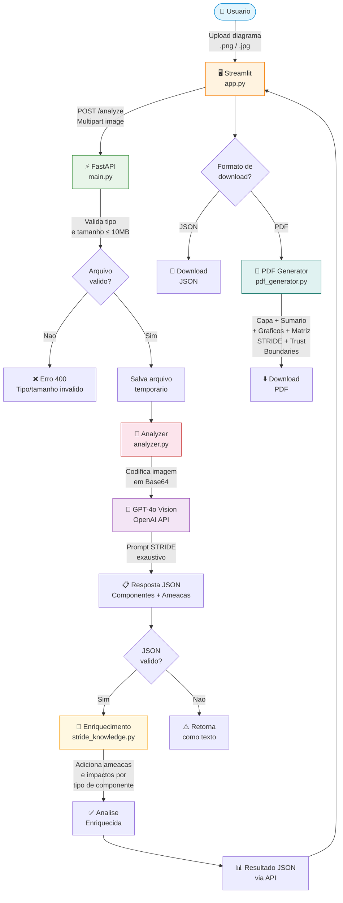

# STRIDE Threat Analyzer

Sistema de analise automatica de ameacas em diagramas de arquitetura de software utilizando Inteligencia Artificial (GPT-4o Vision) e a metodologia STRIDE da Microsoft.

**Hackathon FIAP - Fase 5 | IA para DEVs | Grupo 71**

## Objetivo

Desenvolver um MVP que utiliza IA para interpretar automaticamente um diagrama de arquitetura de sistema, identificando componentes (usuarios, servidores, bases de dados, APIs, etc.) e gerando um Relatorio de Modelagem de Ameacas baseado na metodologia STRIDE, com vulnerabilidades e contramedidas especificas para cada componente.

## Fluxo da Solucao



### Etapas do Pipeline

1. **Upload** (`app.py`): Usuario faz upload de um diagrama de arquitetura via interface Streamlit
2. **Validacao** (`main.py`): API FastAPI valida tipo (PNG/JPG/JPEG) e tamanho (max 10MB) do arquivo
3. **Analise com IA** (`analyzer.py`): Imagem e codificada em base64 e enviada para GPT-4o Vision com prompt STRIDE exaustivo que solicita identificacao de todos os componentes, ameacas, trust boundaries e fluxos de dados
4. **Enriquecimento** (`stride_knowledge.py`): A analise do LLM e complementada com uma base de conhecimento local que adiciona categorias STRIDE faltantes, descricoes detalhadas e impactos contextualizados para cada tipo de componente
5. **Geracao de Relatorio** (`pdf_generator.py`): Relatorio PDF profissional com capa, sumario executivo, grafico de severidade, analise detalhada por componente, fluxos de dados, matriz STRIDE panoramica e trust boundaries
6. **Download**: Usuario baixa relatorio em JSON (dados estruturados) ou PDF (relatorio formatado)

## Tecnologias Utilizadas

| Tecnologia | Uso |
|------------|-----|
| **Python 3.10** | Linguagem principal |
| **OpenAI GPT-4o Vision** | Analise de imagens de arquitetura com IA |
| **FastAPI** | API REST para processamento |
| **Streamlit** | Interface web interativa |
| **ReportLab** | Geracao de relatorios PDF |
| **Pillow** | Processamento de imagens |

## Metodologia STRIDE

O sistema aplica as 6 categorias da metodologia STRIDE da Microsoft:

| Categoria | Descricao | Foco |
|-----------|-----------|------|
| **S**poofing | Falsificacao de identidade | Autenticacao |
| **T**ampering | Adulteracao de dados | Integridade |
| **R**epudiation | Negacao de acoes | Nao-repudio |
| **I**nformation Disclosure | Vazamento de informacoes | Confidencialidade |
| **D**enial of Service | Negacao de servico | Disponibilidade |
| **E**levation of Privilege | Elevacao de privilegios | Autorizacao |

## Resultados da Analise

O sistema gera um relatorio completo contendo:

- **10+ componentes** identificados automaticamente no diagrama
- **40+ ameacas** classificadas por severidade (Alta/Media/Baixa)
- **Contramedidas** especificas para cada ameaca identificada
- **Matriz STRIDE** panoramica mostrando cobertura por componente
- **Trust Boundaries** com analise de fronteiras de confianca
- **Fluxos de Dados** com protocolos, criptografia e autenticacao
- **Risk Score** geral (0-10) com justificativa
- **Grafico de severidade** com distribuicao das ameacas

## Arquitetura do Projeto

```
Hackathon_fase5/
├── main.py                 # API REST (FastAPI)
├── app.py                  # Interface Web (Streamlit)
├── analyzer.py             # Motor de analise com GPT-4o Vision
├── stride_knowledge.py     # Base de conhecimento STRIDE + enriquecimento
├── pdf_generator.py        # Gerador de relatorios PDF
├── test_analyzer.py        # Script de testes
├── requirements.txt        # Dependencias Python
├── .env.example            # Exemplo de configuracao
├── docs/                   # Documentacao
│   ├── QUICKSTART.md       # Guia de inicio rapido
│   └── IADT - Fase 5 - Hackaton.pdf
└── examples/               # Diagramas de exemplo
    └── test_diagram.png
```

Para detalhes sobre cada modulo, consulte [PROJECT_STRUCTURE.md](PROJECT_STRUCTURE.md).

## Instalacao e Uso

### 1. Configuracao

```bash
# Criar e ativar ambiente virtual
python -m venv venv
source venv/bin/activate    # macOS/Linux

# Instalar dependencias
pip install -r requirements.txt

# Configurar chave da API OpenAI
cp .env.example .env
# Edite .env e adicione: OPENAI_API_KEY=sk-sua-chave-aqui
```

### 2. Executar

```bash
# Terminal 1 - API
uvicorn main:app --reload
# API em http://localhost:8000 | Docs em http://localhost:8000/docs

# Terminal 2 - Interface Web
streamlit run app.py
# Interface em http://localhost:8501
```

### 3. Usar

1. Acesse http://localhost:8501
2. Faca upload de um diagrama de arquitetura
3. Clique em "Analisar Ameacas"
4. Aguarde a analise (ate 2 minutos)
5. Baixe o relatorio em JSON ou PDF

Para mais detalhes, consulte o [Guia de Inicio Rapido](docs/QUICKSTART.md).

## Entregaveis

- [x] Codigo fonte do projeto (este repositorio)
- [x] Documentacao detalhando o fluxo da solucao (este README + PROJECT_STRUCTURE.md)
- [ ] Video de ate 15 minutos explicando a solucao
- [x] Link do Github do projeto

---

**Hackathon FIAP - Fase 5 | Modelagem de Ameacas com IA | Grupo 71**
